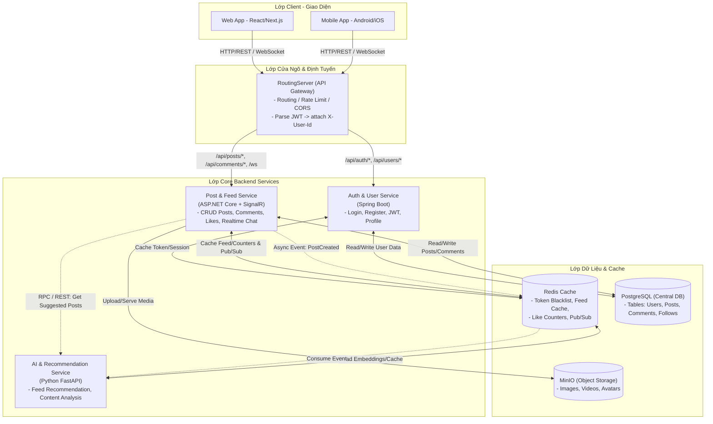

# Phân Tách & Đánh Giá Kiến Trúc Backend Mạng Xã Hội (Polyglot Microservices)

Tài liệu này tổng hợp phân tích, đánh giá, kiến trúc đề xuất và lộ trình triển khai chi tiết cho backend ứng dụng Mạng xã hội sử dụng kiến trúc đa ngôn ngữ (Polyglot Microservices).

---

## 1. Đánh Giá Tổng Quan Các Thành Phần Kiến Trúc

| Thành phần | Công nghệ dự kiến | Đánh giá & Vai trò trong Mạng Xã Hội |
| :--- | :--- | :--- |
| **RoutingServer**  *(API Gateway)* | **Spring Cloud Gateway / Ocelot / Nginx** | **Rất cần thiết.** Làm cổng duy nhất (Single Entry Point) cho Client (Web/Mobile), giấu kín kiến trúc bên trong, định tuyến (Routing), kiểm tra SSL, CORS, Rate Limit. |
| **Core Service 1**  *(Auth/User Service)* | **Spring Boot (Java)** | **Tuyệt vời.** Hệ sinh thái Spring có `Spring Security` và `OAuth2/JWT` cực kỳ mạnh mẽ, chuẩn mực cho bảo mật, quản lý tài khoản, phân quyền. |
| **Core Service 2**  *(Post/Feed Service)* | **ASP.NET Core (C#)** | **Lý tưởng.** ASP.NET Core có hiệu năng xử lý I/O cao top đầu hiện nay, kết hợp với `SignalR` cho tính năng Real-time (thông báo, chat, comment realtime) cực kỳ mượt mà. |
| **AI Service**  *(Recommendation/ML)* | **Python (FastAPI / PyTorch)** | **Tiêu chuẩn vàng.** Tách riêng AI ra khỏi Core Services giúp các tác vụ nặng (tính vector embedding, gợi ý bài viết, lọc nội dung) không làm chậm luồng API chính. |
| **Cache Server** | **Redis** | **Trái tim của Mạng xã hội.** Giúp hệ thống chịu tải cao: Cache Feed người dùng, Cache Profile, đếm Like/Comment realtime, lưu OTP/Token. |
| **Storage & DB** | **PostgreSQL + MinIO (S3)** | **Đúng chuẩn Enterprise.** PostgreSQL lưu dữ liệu quan hệ (Users, Posts, Comments, Relationships), còn MinIO (Object Storage) chuyên dụng để lưu ảnh/video tải tốc độ cao. |

---

## 2. Nhận Xét & Phân Tách Kỹ Thuật (Critical Insights & Best Practices)

### 2.1. Về RoutingServer & Ý tưởng *"Giải mã gói tin thành đối tượng code"*
* **Ý tưởng ban đầu:** *RoutingServer bắt và phân luồng, nếu có thể giải mã gói tin thành đối tượng code (DTO/Domain Object) rồi truyền đi cho Spring Boot / ASP.NET.*
* **Phân tích chuyên môn & Trade-offs:**
  * Nếu RoutingServer (API Gateway) vừa nhận JSON từ Client, vừa **deserialize/giải mã toàn bộ body thành Object/DTO cụ thể của nghiệp vụ** rồi mới chuyển cho backend, thì API Gateway sẽ bị **Tightly Coupled (bó buộc cực kỳ chặt chẽ)** với business logic của từng service phía sau.
  * **Hậu quả:** Mỗi lần service ASP.NET thêm 1 trường dữ liệu cho bài viết (ví dụ thêm `Hashtags` hay `Mentions`), bạn lại phải sửa code DTO và deploy lại cả RoutingServer!
* **💡 Khuyến nghị Best Practice cho RoutingServer:**
  * **Chỉ giải mã và xử lý Header / Security Token (Cross-cutting Concerns):** RoutingServer parse `Authorization Token (JWT)`, xác thực chữ ký (hợp lệ hay không), lấy ra `UserId`, `Role` và **gắn vào HTTP Header mới (ví dụ: `X-User-Id`, `X-User-Role`)** rồi chuyển tiếp xuống cho Spring Boot / ASP.NET.
  * **Giữ nguyên Body (Payload Passthrough):** Phần nội dung request (JSON body, Multipart form data của ảnh/video) nên được forward nguyên bản xuống cho Spring Boot hoặc ASP.NET tự parse thành đối tượng code (DTO) tương ứng.
  * **Công cụ khuyên dùng:** Bạn có thể dùng **Spring Cloud Gateway** (Java) hoặc **Ocelot** (ASP.NET Core) để code API Gateway nhẹ nhàng, dễ quản lý route.

### 2.2. Về Giao Tiếp Giữa Các Server (Inter-service Communication)
Khi hệ thống tách làm nhiều máy chủ (Spring Boot, ASP.NET Core, Python), việc giao tiếp cần được thiết kế rõ ràng theo 2 mô hình:
* **Đồng bộ (Synchronous - REST API / gRPC):**
  * *Áp dụng khi:* Cần kết quả trả về ngay để phản hồi cho Client.
  * *Ví dụ:* `Post Service (ASP.NET)` cần gọi `AI Service (Python)` ngay lập tức để lấy danh sách Top 10 ID bài viết gợi ý cho User đang mở App.
  * *Khuyên dùng:* Dùng **gRPC** hoặc **REST/HTTP (FastAPI)** tốc độ cao.
* **Bất đồng bộ (Asynchronous - Message Queue / Event Bus):**
  * *Áp dụng khi:* Các tác vụ nặng, chạy nền, không yêu cầu Client phải chờ đợi.
  * *Ví dụ:* Khi một User tạo bài viết mới trên `ASP.NET Core`, không nên bắt User chờ Python AI chạy thuật toán nhận diện ảnh hay tạo vector embedding rồi mới trả về thành công.
  * *Khuyên dùng:* Thêm một **Message Queue (RabbitMQ / Kafka)** hoặc sử dụng tính năng **Pub/Sub của Redis**. `ASP.NET Core` chỉ cần lưu bài viết vào DB, bắn 1 sự kiện `PostCreatedEvent` vào Redis Pub/Sub, `Python AI Service` ngầm nhận sự kiện để xử lý ở background.

### 2.3. Về Quản Lý Dữ Liệu Hình Ảnh & Video (Media Storage Architecture)
* **Quy tắc cốt lõi:** Tuyệt đối không lưu file ảnh/video nhị phân (BLOB) trực tiếp vào trong bảng PostgreSQL/MySQL. Việc này sẽ làm phình to DB chỉ sau vài ngày, làm sập bộ nhớ đệm và chậm toàn bộ các câu truy vấn SQL.
* **Quy trình chuẩn cho Mạng xã hội:**
  1. Client gửi yêu cầu upload ảnh/video đến `ASP.NET Core (Post Service)` (hoặc lấy Pre-signed URL từ service rồi upload thẳng lên Storage).
  2. `ASP.NET Core` stream file lên **MinIO / AWS S3 Object Storage**.
  3. MinIO trả về một URL (ví dụ: `http://minio:9000/posts/2026/07/img_123.jpg`).
  4. `ASP.NET Core` chỉ lưu chuỗi URL đó cùng chuỗi `caption` vào bảng `post_media` trong **PostgreSQL**.

### 2.4. Tận Dụng Sức Mạnh Của Redis Cho Mạng Xã Hội
Một mạng xã hội muốn mượt mà thì không thể truy vấn DB liên tục khi lướt Feed. Cần tận dụng tối đa Redis:
* **Timeline / Feed Cache (Fan-out on write):** Khi User A (có 500 bạn bè) đăng bài, ID bài viết sẽ được push ngay vào `Redis List / Sorted Set` của 500 bạn bè đó. Khi bạn bè mở app, chỉ cần đọc danh sách ID từ Redis -> truy xuất bài viết nhanh dưới vài ms.
* **Counters (Like / Comment Count):** Khi bấm Like, tăng biến đếm trực tiếp trên Redis (`INCR post:123:likes`) và phản hồi ngay cho UI < 10ms. Một worker chạy ngầm sẽ định kỳ (ví dụ mỗi 1-5 phút) đồng bộ con số từ Redis xuống PostgreSQL (gọi là kỹ thuật *Write-behind / Write-back cache*).
* **Token Blacklist & Session:** Lưu Refresh Token, OTP, hoặc danh sách JWT bị thu hồi khi User đăng xuất.

---

## 3. Sơ Đồ Kiến Trúc Hoàn Thiện (Optimized Architecture Diagram)

---

## 4. Lộ Trình Triển Khai Đề Xuất (Step-by-Step Roadmap)

Để không bị ngợp bởi sự phức tạp của hệ thống đa ngôn ngữ khi bắt đầu từ một dự án trống, chúng ta nên triển khai theo từng Phase chuẩn chỉ:

### Phase 1: Xây dựng nền tảng Docker & Infrastructure Setup
- Viết `docker-compose.yml` để khởi chạy các dịch vụ nền: **PostgreSQL**, **Redis**, và **MinIO** local.
- Thiết kế sơ đồ Cơ sở dữ liệu (Database Schema / ERD) cho các bảng core: `users`, `posts`, `comments`, `post_media`, `likes`, `follows`.
- Tạo script khởi tạo Database sơ bộ (`init.sql`).

### Phase 2: Auth Service (Spring Boot)
- Khởi tạo project Spring Boot tại `backend/AuthServer`.
- Cấu hình kết nối PostgreSQL & Redis.
- Viết API:
  - `POST /api/auth/register`: Đăng ký tài khoản (mã hóa mật khẩu BCrypt/Argon2).
  - `POST /api/auth/login`: Đăng nhập, cấp phát Access Token (JWT) & Refresh Token (Lưu Redis).
  - `GET/PUT /api/users/profile`: Quản lý thông tin profile.

### Phase 3: Post Service (ASP.NET Core)
- Khởi tạo project ASP.NET Core Web API tại `backend/ServiceServer` (hoặc đổi tên thành `backend/PostServer`).
- Cấu hình Entity Framework Core kết nối PostgreSQL & Redis.
- Tích hợp MinIO SDK để xử lý upload ảnh/video.
- Viết API:
  - `POST /api/posts`: Tạo bài viết mới kèm upload media.
  - `GET /api/posts/feed`: Lấy danh sách bài viết New Feed (có áp dụng Redis Cache).
  - `POST /api/posts/{id}/like` và `POST /api/posts/{id}/comments`: Like và Bình luận bài viết.

### Phase 4: RoutingServer (API Gateway)
- Khởi tạo `backend/RoutingServer` (Sử dụng Spring Cloud Gateway hoặc Ocelot).
- Cấu hình Routing Rules để gom toàn bộ request từ Client về 1 cổng duy nhất (ví dụ Port `8080` hoặc `5000`).
- Tích hợp bộ lọc (Gateway Filter) để parse JWT Token, kiểm tra tính hợp lệ và tự động chèn header `X-User-Id` xuống cho Spring Boot / ASP.NET.

### Phase 5: Python AI Service & Realtime SignalR
- Khởi tạo `backend/AIServer` (Python FastAPI + PyTorch/Scikit-learn).
- Viết API/Worker thuật toán gợi ý bài viết dựa trên hành vi tương tác (Likes, Comments, Tags).
- Tích hợp SignalR vào ASP.NET Core (`backend/PostServer`) để đẩy thông báo Real-time (WebSocket) xuống Web/Mobile khi có người tương tác với bài viết.
