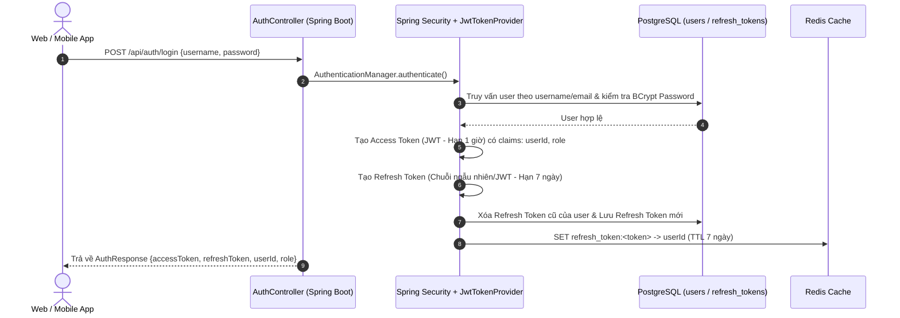
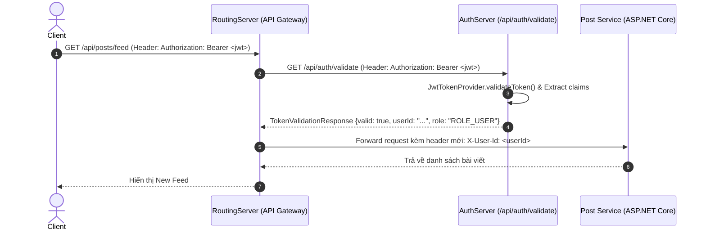

# Kiến Trúc & Tài Liệu Kỹ Thuật: Auth Service (Spring Boot 3)

`AuthService` là một trong hai máy chủ xử lý nghiệp vụ cốt lõi (Core Backend Services) trong kiến trúc Mạng Xã Hội Polyglot Microservices. Máy chủ này chịu trách nhiệm độc quyền về **Quản lý danh tính (Identity Management)**, **Bảo mật (Security)**, **Xác thực (Authentication)** và **Phân quyền (Authorization)** cho toàn bộ hệ thống.

---

## 1. Công Nghệ Sử Dụng (Tech Stack)

| Công nghệ | Phiên bản | Mục đích & Lý do lựa chọn |
| :--- | :--- | :--- |
| **Java / Spring Boot** | **3.2.5 (Java 17)** | Nền tảng Enterprise mạnh mẽ, ổn định, hệ sinh thái phong phú. |
| **Spring Security** | **6.x** | Quản lý bảo mật theo mô hình **Stateless (Không trạng thái)**, tích hợp bộ lọc filter chain. |
| **JSON Web Token (JWT)** | **JJWT 0.12.5** | Thuật toán `HMAC SHA-256 (HS256)`. Tạo Access Token & Refresh Token an toàn. |
| **Spring Data JPA (Hibernate)**| **6.x** | ORM tương tác với cơ sở dữ liệu quan hệ **PostgreSQL**. Khóa chính `UUID`. |
| **Spring Data Redis** | **3.x** | Kết nối **Redis Cache** để lưu Refresh Token (giúp truy xuất siêu nhanh) và Blacklist token khi Logout. |
| **Lombok** | **Latest** | Giảm thiểu boilerplate code (`@Getter`, `@Setter`, `@Builder`, `@RequiredArgsConstructor`). |

---

## 2. Sơ Đồ Kiến Trúc & Luồng Hoạt Động (Architecture & Data Flow)

### 2.1. Cấu Trúc Lớp (Layered Architecture)
dự án được phân chia theo kiến trúc nhiều lớp (Multi-layer / Clean Architecture):

```
backend/AuthServer/src/main/java/com/mxh/auth/
 ├── AuthServiceApplication.java     # Entry point
 ├── controller/                     # Lớp Giao tiếp REST API (Tiếp nhận request từ Client/Gateway)
 │    ├── AuthController.java        # Xử lý /register, /login, /refresh, /logout, /validate
 │    ├── UserController.java        # Xử lý /profile và truy vấn user
 │    └── HealthController.java      # Xử lý /health check cho Docker/Kubernetes
 ├── service/                        # Lớp Nghiệp vụ cốt lõi (Business Logic)
 │    ├── AuthService.java & Impl    # Logic tạo token, kiểm tra mật khẩu bcrypt, quản lý session
 │    └── UserService.java & Impl    # Logic truy xuất thông tin người dùng
 ├── security/                       # Lớp Bảo mật & Bộ lọc JWT
 │    ├── SecurityConfig.java        # Cấu hình Spring Security 6 Filter Chain (Stateless, CORS/CSRF)
 │    ├── JwtTokenProvider.java      # Bộ công cụ ký, parse, xác thực chữ ký JWT HMAC SHA-256
 │    ├── JwtAuthenticationFilter.java # Bộ lọc chặn trước request để kiểm tra header Authorization
 │    └── CustomUserDetails...java   # Adapter chuyển đổi giữa User entity và Spring Security context
 ├── domain/                         # Lớp Thực thể & Truy cập dữ liệu (Data Access / Entities)
 │    ├── User.java & Repository     # Entity ánh xạ bảng `users` trong PostgreSQL
 │    └── RefreshToken.java & Repo   # Entity ánh xạ bảng `refresh_tokens`
 └── dto/                            # Lớp Chuyển giao dữ liệu (Data Transfer Objects)
      ├── RegisterRequest, LoginRequest, AuthResponse, ApiResponse, ...
```

### 2.2. Luồng Đăng Nhập & Cấp Phát Cặp Token (Login & Token Generation Flow)



### 2.3. Luồng Xác Thực Token Từ API Gateway (Gateway Validation Flow)
Khi Client gọi một API của `Post Service (ASP.NET Core)` hoặc `AI Service (Python)`, API Gateway (`RoutingServer`) có thể gọi sang `AuthServer` để xác thực token mà không cần lộ Secret Key:



---

## 3. Danh Sách API Endpoints & Chuẩn Giao Tiếp

Mọi phản hồi từ `AuthService` đều được chuẩn hóa theo cấu trúc `ApiResponse<T>`:
```json
{
  "success": true,
  "message": "Thông báo trạng thái",
  "data": { ... }
}
```

### 3.1. Nhóm API Xác Thực (`/api/auth/*` - Public, Không yêu cầu Token)

#### 🔹 `POST /api/auth/register` - Đăng ký tài khoản
* **Request Body:**
  ```json
  {
    "username": "nguyenvana",
    "email": "vana@mxh.local",
    "password": "Password123!",
    "fullName": "Nguyễn Văn A"
  }
  ```
* **Response `201 Created`:** Trả về `AuthResponse` gồm `accessToken` và `refreshToken`.

#### 🔹 `POST /api/auth/login` - Đăng nhập
* **Request Body:**
  ```json
  {
    "usernameOrEmail": "nguyenvana",
    "password": "Password123!"
  }
  ```
* **Response `200 OK`:** Trả về thông tin user kèm cặp token.

#### 🔹 `POST /api/auth/refresh` - Làm mới Access Token
Khi `accessToken` (1 giờ) hết hạn, Client gửi `refreshToken` để xin lại `accessToken` mới mà không cần bắt user nhập lại mật khẩu.
* **Request Body:**
  ```json
  {
    "refreshToken": "eyJhbGciOiJIUzI1NiJ9..."
  }
  ```
* **Response `200 OK`:** Trả về `accessToken` mới.

#### 🔹 `POST /api/auth/logout` - Đăng xuất
Thu hồi `refreshToken` khỏi PostgreSQL và Redis Cache.
* **Request Body:**
  ```json
  {
    "refreshToken": "eyJhbGciOiJIUzI1NiJ9..."
  }
  ```

#### 🔹 `GET /api/auth/validate` - Kiểm tra tính hợp lệ của Token
* **Headers:** `Authorization: Bearer <accessToken>`
* **Response `200 OK`:**
  ```json
  {
    "success": true,
    "message": "Xác thực token",
    "data": {
      "valid": true,
      "userId": "b1ffcd00-ad1c-5fa9-cc7e-7cc0ce491b22",
      "username": "nguyenvana",
      "role": "ROLE_USER"
    }
  }
  ```

### 3.2. Nhóm API Người Dùng (`/api/users/*` - Yêu cầu Bearer Token)

* `GET /api/users/profile`: Lấy thông tin cá nhân của người dùng đang thực hiện request (tự động parse từ Bearer JWT trong Header).
* `GET /api/users/{id}`: Xem thông tin công khai của một user bất kỳ theo UUID.
* `GET /api/users/username/{username}`: Xem thông tin công khai theo Username.

---

## 4. Cách Khởi Chạy & Cấu Hình (How to Run)

### 4.1. Cấu hình Môi Trường (`application.yml` / Environment Variables)
Máy chủ sử dụng các biến môi trường sau (đã có giá trị mặc định cho local):
* `DB_HOST`: Mặc định `localhost` (khi chạy Docker network thì là `postgres`)
* `DB_PORT`: Mặc định `5432`
* `DB_NAME`: Mặc định `mxh_db`
* `DB_USER`: Mặc định `mxh_user`
* `DB_PASSWORD`: Mặc định `mxh_password_123!`
* `REDIS_HOST`: Mặc định `localhost` (khi chạy Docker thì là `redis`)
* `REDIS_PASSWORD`: Mặc định `redis_password_123!`
* `JWT_SECRET`: Chuỗi bí mật ít nhất 256-bit để ký HMAC SHA-256.

### 4.2. Khởi chạy bằng Maven
Đảm bảo bạn đã bật `docker-compose up -d` ở thư mục root dự án để có PostgreSQL và Redis, sau đó chạy:
```bash
cd backend/AuthServer
mvn clean spring-boot:run
```
Dịch vụ sẽ khởi động và lắng nghe tại cổng **`8081`**. Kiểm tra sức khỏe dịch vụ bằng cách truy cập: `http://localhost:8081/api/health`.

### 4.3. Đóng gói Docker Container
```bash
cd backend/AuthServer
docker build -t mxh-auth-service:latest .
docker run -p 8081:8081 --network mxh_network mxh-auth-service:latest
```
