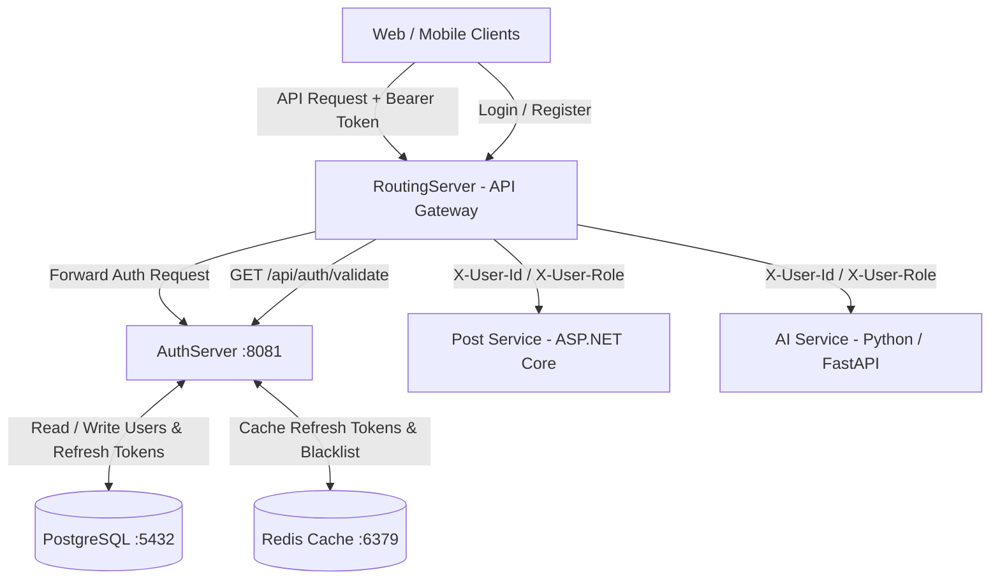
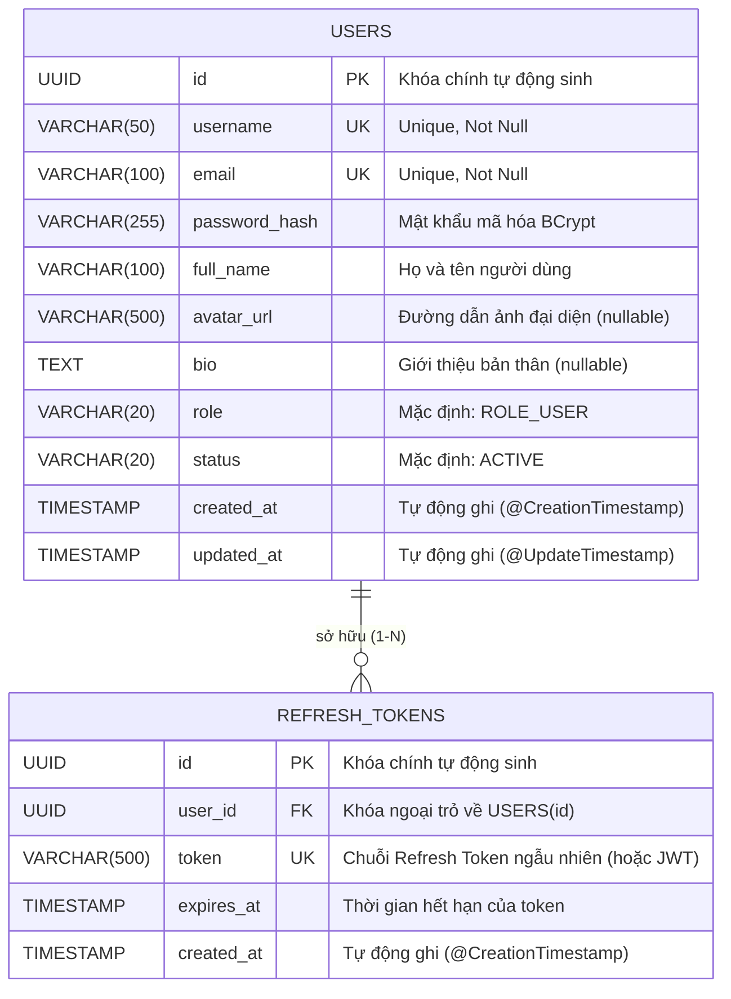
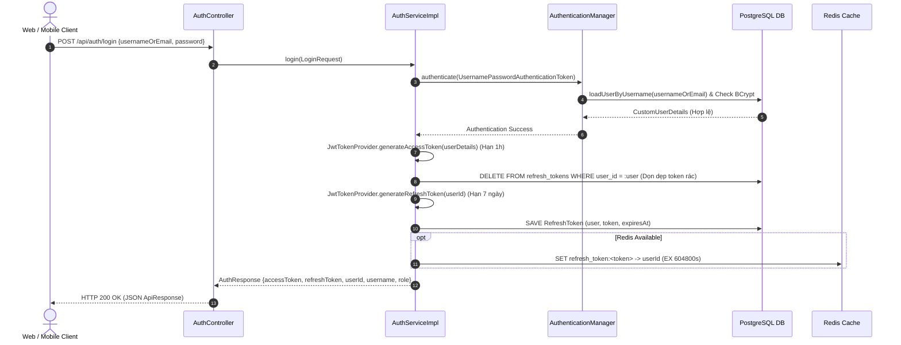
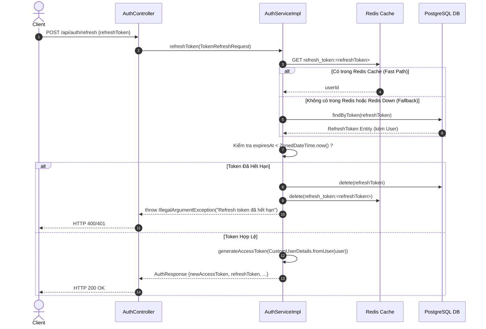
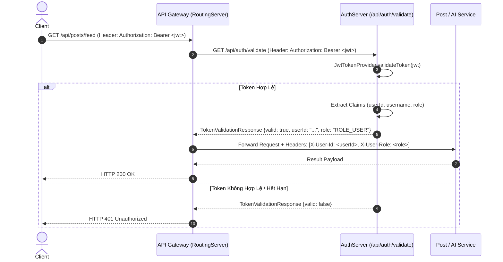

# Tài Liệu Kỹ Thuật Tổng Hợp: Auth Service (`backend/AuthServer`)

> [!IMPORTANT]
> **Mục đích tài liệu:** Tài liệu này được biên soạn đầy đủ và cặn kẽ nhằm giúp các lập trình viên (Developers / DevOps) hiểu sâu về toàn bộ kiến trúc, cơ chế bảo mật, mô hình dữ liệu, luồng xác thực và đặc tả API của dịch vụ **AuthServer** trong hệ thống Mạng Xã Hội Polyglot Microservices.

---

## 1. Giới Thiệu & Vai Trò Trong Hệ Thống

**AuthServer** (`auth-service`) là máy chủ cốt lõi đảm nhận vai trò **Quản lý danh tính (Identity Management)** và **Bảo mật (Authentication & Authorization)** cho toàn bộ hệ thống mạng xã hội.



### Điểm nhấn kiến trúc:
1. **Phân tách trách nhiệm:** Các Microservices nghiệp vụ (Post, AI, Media,...) không lưu trữ mật khẩu hay khóa bí mật JWT (`JWT_SECRET`). Thay vào đó, API Gateway (`RoutingServer`) sẽ gọi endpoint `/api/auth/validate` của `AuthServer` để xác thực token trước khi điều hướng request.
2. **Cơ chế Stateless tuyệt đối:** `AuthServer` không sử dụng HTTP Session (`SessionCreationPolicy.STATELESS`). Mọi trạng thái xác thực đều nằm trong **JWT Access Token** (ngắn hạn) và **Refresh Token** (dài hạn).

---

## 2. Công Nghệ Sử Dụng (Tech Stack & Dependencies)

Dịch vụ được xây dựng trên nền tảng **Java 17** và **Spring Boot 3.2.5** (xem cấu hình tại [pom.xml](pom.xml)).

| Thư viện / Công nghệ | Phiên bản / Module | Mục đích & Vai trò |
| :--- | :--- | :--- |
| **Java / Spring Boot** | `3.2.5` (`spring-boot-starter-web`) | Framework nền tảng cung cấp RESTful web container (Tomcat) và cơ chế Dependency Injection. |
| **Spring Security** | `6.x` (`spring-boot-starter-security`) | Bộ lọc bảo mật `SecurityFilterChain`, quản lý `AuthenticationManager`, `UserDetailsService` và mã hóa mật khẩu. |
| **JSON Web Token (JJWT)** | `0.12.5` (`jjwt-api`, `jjwt-impl`, `jjwt-jackson`) | Ký, xác minh và phân tích chữ ký số JWT theo thuật toán `HMAC SHA-256 (HS256)`. |
| **Spring Data JPA** | `6.x` (`spring-boot-starter-data-jpa`) | ORM (Hibernate) quản lý ánh xạ thực thể xuống cơ sở dữ liệu quan hệ PostgreSQL. |
| **PostgreSQL Driver** | `runtime` (`org.postgresql:postgresql`) | Driver kết nối CSDL chính lưu bảng `users` và `refresh_tokens`. |
| **Spring Data Redis** | `3.x` (`spring-boot-starter-data-redis`) | Tương tác với Redis Cache (lưu trữ nóng Refresh Token và danh sách Blacklist khi đăng xuất). |
| **Jakarta Validation** | `Latest` (`spring-boot-starter-validation`) | Kiểm tra tính hợp lệ dữ liệu đầu vào (`@Valid`, `@NotBlank`, `@Email`, `@Size`). |
| **Lombok** | `Latest` (`org.projectlombok:lombok`) | Tự động sinh `Getter`, `Setter`, `Builder`, `NoArgsConstructor`, `RequiredArgsConstructor` giảm boilerplate code. |

---

## 3. Cấu Trúc Mã Nguồn (Clean Architecture)

Toàn bộ mã nguồn được tổ chức theo kiến trúc phân lớp chuẩn tại package `com.mxh.auth`:

```
backend/AuthServer/src/main/java/com/mxh/auth/
 ├── AuthServiceApplication.java                 # Entry point khởi chạy Spring Boot application
 ├── controller/                                 # REST Controller Layer (Tiếp nhận HTTP request)
 │    ├── AuthController.java                    # API xác thực (/register, /login, /refresh, /logout, /validate)
 │    ├── UserController.java                    # API thông tin người dùng (/profile, /{id}, /username/{username})
 │    └── HealthController.java                  # API kiểm tra trạng thái dịch vụ (/api/health -> status: UP)
 ├── domain/                                     # Domain Layer (ORM Entities & Repositories)
 │    ├── User.java                              # Entity ánh xạ bảng `users`
 │    ├── UserRepository.java                    # JPA Repository thao tác với `User`
 │    ├── RefreshToken.java                      # Entity ánh xạ bảng `refresh_tokens`
 │    └── RefreshTokenRepository.java            # JPA Repository thao tác với `RefreshToken`
 ├── security/                                   # Security Layer (Spring Security & JWT Mechanics)
 │    ├── SecurityConfig.java                    # Cấu hình Filter Chain, Stateless, Provider, BCrypt
 │    ├── JwtTokenProvider.java                  # Utility ký HMAC SHA-256, kiểm tra và trích xuất claims từ JWT
 │    ├── JwtAuthenticationFilter.java           # Filter chặn request để parse Bearer Token từ Header
 │    ├── CustomUserDetails.java                 # Adapter chuyển đổi giữa User Entity và Spring Security Principal
 │    └── CustomUserDetailsService.java          # Implementation của UserDetailsService load user từ DB
 ├── service/                                    # Service Layer (Business Logic)
 │    ├── AuthService.java & AuthServiceImpl.java # Logic đăng ký, đăng nhập, làm mới & thu hồi token
 │    └── UserService.java & UserServiceImpl.java # Logic truy xuất thông tin người dùng
 └── dto/                                        # Data Transfer Objects (Payloads Giao tiếp)
      ├── ApiResponse.java                       # Wrapper chuẩn hóa cho toàn bộ phản hồi HTTP
      ├── RegisterRequest.java                   # Payload đăng ký tài khoản (@Valid)
      ├── LoginRequest.java                      # Payload đăng nhập (usernameOrEmail, password)
      ├── TokenRefreshRequest.java               # Payload chứa refreshToken
      ├── AuthResponse.java                      # Phản hồi chứa cặp Access/Refresh Token và thông tin cơ bản
      ├── TokenValidationResponse.java           # Phản hồi xác thực token cho API Gateway
      └── UserProfileResponse.java               # Phản hồi chi tiết profile người dùng
```

---

## 4. Mô Hình Dữ Liệu & Cơ Sở Dữ Liệu (ER Diagram & Storage)

### 4.1. Sơ đồ quan hệ thực thể (PostgreSQL ERD)

Khóa chính cho tất cả các bảng đều sử dụng kiểu dữ liệu **`UUID`** nhằm tăng tính bảo mật (tránh đoán nhận ID tuần tự) và hỗ trợ phân tán dữ liệu trong tương lai.



### 4.2. Cấu trúc bộ nhớ đệm trên Redis (`StringRedisTemplate`)

Bên cạnh PostgreSQL, `AuthService` tận dụng **Redis** để lưu trữ tốc độ cao (Hot Cache) với các Key sau:

| Key Format | Giá trị (Value) | Thời gian sống (TTL) | Ý nghĩa nghiệp vụ |
| :--- | :--- | :--- | :--- |
| `refresh_token:<token>` | `userId` (Chuỗi UUID) | 7 ngày (`604,800,000 ms`) | Cho phép truy xuất nhanh ID người dùng từ Refresh Token mà không cần query vào PostgreSQL. Được xóa lập tức khi user gọi API `/logout` hoặc token hết hạn. |
| `blacklist_token:<jwt>` | `"blacklisted"` | Hạn còn lại của JWT | Dùng để khóa (invalidate) ngay lập tức các Access Token trước thời hạn khi người dùng đăng xuất hoặc đổi mật khẩu. |

---

## 5. Cơ Chế Bảo Mật & Xác Thực (Security & Authentication Flows)

### 5.1. Cấu hình Spring Security ([SecurityConfig.java](src/main/java/com/mxh/auth/security/SecurityConfig.java))
* **Mã hóa mật khẩu (`PasswordEncoder`):** Sử dụng `BCryptPasswordEncoder` (độ phức tạp chuẩn mặc định $2^{10}$ rounds).
* **Phân định quyền truy cập (Filter Chain Path Matching):**
  * **Public (Không cần token):**
    * `/api/auth/register` (Đăng ký)
    * `/api/auth/login` (Đăng nhập)
    * `/api/auth/refresh` (Làm mới token)
    * `/api/auth/validate` (API Gateway kiểm tra token)
    * `/api/health` (Health check)
  * **Protected (Yêu cầu JWT hợp lệ trong Header):** Toàn bộ các HTTP request còn lại (ví dụ `/api/users/profile`).

### 5.2. Luồng Đăng nhập & Cấp phát Token (Login Sequence Diagram)



> [!TIP]
> **Resilience Best Practice:** Tại [AuthServiceImpl.java:L178-L187](src/main/java/com/mxh/auth/service/AuthServiceImpl.java#L178-L187), logic lưu vào Redis được bọc trong `try-catch`. Nếu instance Redis gặp sự cố hoặc chưa bật, hệ thống ghi nhận log cảnh báo (`log.warn`) và **vẫn tiếp tục phục vụ người dùng bằng cơ sở dữ liệu PostgreSQL**, đảm bảo tính độ sẵn sàng cao (High Availability).

---

### 5.3. Luồng Làm mới Token (Refresh Token Sequence Diagram)

Khi Access Token (1 giờ) hết hạn, phía Client không bắt buộc người dùng đăng nhập lại mà ngầm gửi API Refresh:



---

### 5.4. Luồng Xác thực từ API Gateway (Gateway Token Validation)

Để giữ kín `JWT_SECRET` trong nội bộ `AuthServer`, mọi API request đi vào hệ thống đều qua `RoutingServer` xác thực:



---

## 6. Chi Tiết Đặc Tả API Endpoints (API Reference)

Mọi phản hồi từ `AuthServer` đều tuân theo format chuẩn hoá của `ApiResponse<T>`:
```json
{
  "success": true,
  "message": "Thông báo mô tả kết quả",
  "data": { ... payload đối tượng ... }
}
```

### 6.1. Nhóm API Xác Thực (`/api/auth/*`) - Public

#### 1. Đăng ký tài khoản (`POST /api/auth/register`)
* **Headers:** `Content-Type: application/json`
* **Request Body:**
  ```json
  {
    "username": "nguyenvana",
    "email": "vana@mxh.local",
    "password": "Password123!",
    "fullName": "Nguyễn Văn A"
  }
  ```
* **Validation Constraints ([RegisterRequest.java](src/main/java/com/mxh/auth/dto/RegisterRequest.java)):**
  * `username`: Từ 3 đến 50 ký tự, không trống.
  * `email`: Đúng định dạng email chuẩn.
  * `password`: Từ 6 đến 100 ký tự.
* **Response Status:** `201 Created`
  ```json
  {
    "success": true,
    "message": "Đăng ký tài khoản thành công",
    "data": {
      "accessToken": "eyJhbGciOiJIUzI1NiJ9.eyJzdWIiOiJiMWZmY2QwMC...",
      "refreshToken": "eyJhbGciOiJIUzI1NiJ9.eyJzdWIiOiJiMWZmY2QwMC...",
      "tokenType": "Bearer",
      "userId": "b1ffcd00-ad1c-5fa9-cc7e-7cc0ce491b22",
      "username": "nguyenvana",
      "fullName": "Nguyễn Văn A",
      "role": "ROLE_USER"
    }
  }
  ```

#### 2. Đăng nhập (`POST /api/auth/login`)
* **Request Body:**
  ```json
  {
    "usernameOrEmail": "vana@mxh.local",
    "password": "Password123!"
  }
  ```
  *(Cho phép đăng nhập bằng hoặc `username` hoặc `email`)*
* **Response Status:** `200 OK` (Cấu trúc `AuthResponse` tương tự API Register).

#### 3. Làm mới Token (`POST /api/auth/refresh`)
* **Request Body:**
  ```json
  {
    "refreshToken": "eyJhbGciOiJIUzI1NiJ9.eyJzdWIiOiJiMWZmY2QwMC..."
  }
  ```
* **Response Status:** `200 OK` (Trả về `accessToken` mới hạn 1 giờ, giữ nguyên `refreshToken`).

#### 4. Đăng xuất (`POST /api/auth/logout`)
* **Headers:** `Authorization: Bearer <accessToken>`
* **Request Body:**
  ```json
  {
    "refreshToken": "eyJhbGciOiJIUzI1NiJ9.eyJzdWIiOiJiMWZmY2QwMC..."
  }
  ```
* **Response Status:** `200 OK`
  ```json
  {
    "success": true,
    "message": "Đăng xuất thành công",
    "data": null
  }
  ```

#### 5. Kiểm tra Token hợp lệ (`GET /api/auth/validate`)
* **Headers:** `Authorization: Bearer <accessToken>`
* **Response Status:** `200 OK`
  ```json
  {
    "success": true,
    "message": "Xác thực token",
    "data": {
      "valid": true,
      "userId": "b1ffcd00-ad1c-5fa9-cc7e-7cc0ce491b22",
      "username": "nguyenvana",
      "role": "ROLE_USER"
    }
  }
  ```

---

### 6.2. Nhóm API Người Dùng (`/api/users/*`) - Protected (Yêu cầu JWT)

#### 1. Lấy thông tin cá nhân (`GET /api/users/profile`)
* **Headers:** `Authorization: Bearer <accessToken>`
* **Cơ chế:** [JwtAuthenticationFilter](src/main/java/com/mxh/auth/security/JwtAuthenticationFilter.java) parse Bearer token và nạp `CustomUserDetails` vào `SecurityContextHolder`. [UserController.java:L23](src/main/java/com/mxh/auth/controller/UserController.java#L23) trích xuất bằng `@AuthenticationPrincipal`.
* **Response Status:** `200 OK`
  ```json
  {
    "success": true,
    "message": "Lấy profile cá nhân thành công",
    "data": {
      "id": "b1ffcd00-ad1c-5fa9-cc7e-7cc0ce491b22",
      "username": "nguyenvana",
      "email": "vana@mxh.local",
      "fullName": "Nguyễn Văn A",
      "avatarUrl": "https://cdn.mxh.local/avatars/vana.jpg",
      "bio": "Lập trình viên Java/Spring Boot",
      "role": "ROLE_USER",
      "status": "ACTIVE",
      "createdAt": "2026-07-16T10:30:00+07:00"
    }
  }
  ```

#### 2. Lấy thông tin công khai theo UUID (`GET /api/users/{id}`)
* **Path Variable:** `id` (UUID của user cần tra cứu).
* **Response Status:** `200 OK` (`UserProfileResponse`).

#### 3. Lấy thông tin công khai theo Username (`GET /api/users/username/{username}`)
* **Path Variable:** `username` (Ví dụ `nguyenvana`).
* **Response Status:** `200 OK` (`UserProfileResponse`).

---

### 6.3. Nhóm API Kiểm Tra Sức Khỏe (`/api/health`) - Public
* **Method:** `GET /api/health`
* **Phản hồi (`200 OK`):**
  ```json
  {
    "status": "UP",
    "service": "AuthService",
    "timestamp": 1784260580123
  }
  ```

---

## 7. Cấu Hình & Biến Môi Trường (Configuration Reference)

Tệp cấu hình chính được định nghĩa tại [application.yml](src/main/resources/application.yml). Các lập trình viên và kỹ sư DevOps khi triển khai trên Docker/Kubernetes có thể ghi đè bằng các biến môi trường (Environment Variables) sau:

| Biến Môi Trường (`ENV`) | Giá trị mặc định (Local Dev) | Mô tả tham số |
| :--- | :--- | :--- |
| `SERVER_PORT` | `8081` | Cổng lắng nghe HTTP của AuthServer. |
| `DB_HOST` | `localhost` | Host hoặc tên service Docker của PostgreSQL (`postgres`). |
| `DB_PORT` | `5432` | Cổng của dịch vụ PostgreSQL. |
| `DB_NAME` | `mxh_db` | Tên cơ sở dữ liệu. |
| `DB_USER` | `mxh_user` | Tài khoản đăng nhập CSDL. |
| `DB_PASSWORD` | `mxh_password_123!` | Mật khẩu kết nối CSDL. |
| `REDIS_HOST` | `localhost` | Host hoặc tên service Docker của Redis Cache (`redis`). |
| `REDIS_PORT` | `6379` | Cổng kết nối Redis. |
| `REDIS_PASSWORD` | `redis_password_123!` | Mật khẩu kết nối Redis. |
| `JWT_SECRET` | `9a8b7c6d5e4f3a2b1c0d9e8f...` (Chuỗi 64 ký tự Hex) | Chuỗi bí mật tối thiểu **256 bits (32 bytes)** để thuật toán HMAC SHA-256 ký Token một cách an toàn. **(Bắt buộc thay đổi trên môi trường Production)**. |

---

## 8. Hướng Dẫn cho Developer & Những Lưu Ý Quan Trọng

### 8.1. Hướng dẫn chạy tại Local (Local Development Setup)
1. **Khởi động tầng Infrastructure:** Đảm bảo PostgreSQL và Redis đang chạy (có thể dùng lệnh `docker-compose up -d postgres redis` từ thư mục gốc dự án).
2. **Khởi chạy AuthServer:**
   ```bash
   cd backend/AuthServer
   mvn clean spring-boot:run
   ```
3. **Kiểm tra hoạt động:** Mở trình duyệt hoặc Postman truy cập `http://localhost:8081/api/health`.

### 8.2. Các lưu ý quan trọng khi tùy chỉnh hoặc mở rộng code
* **Lưu ý về JWT Signing Key:** Chuỗi `app.jwt.secret` trong cấu hình bắt buộc phải đủ độ dài (ít nhất 256 bit). Nếu dùng chuỗi ngắn hơn, `Jwts.SIG.HS256` của JJWT 0.12.5 sẽ ném ngoại lệ `WeakKeyException` ngay lúc khởi động hoặc ký token.
* **Quy tắc dọn dẹp Refresh Token:** Khi viết thêm các nghiệp vụ đổi mật khẩu hoặc khóa tài khoản (`status = BLOCKED`), cần gọi `refreshTokenRepository.deleteByUser(user)` và xóa key `refresh_token:<token>` trong Redis để ép người dùng phải đăng nhập lại trên mọi thiết bị.
* **Xử lý Ngoại lệ (Exception Handling):** Hiện tại, các ngoại lệ như `IllegalArgumentException` hay `IllegalStateException` từ service đang ném thẳng ra ngoài. Khi mở rộng, cần bổ sung một `@ControllerAdvice` (`GlobalExceptionHandler`) nhằm bắt các ngoại lệ này và chuyển thành format `ApiResponse.error(...)` chuẩn xác với mã HTTP `400 Bad Request` hoặc `401 Unauthorized` thay vì để Spring Boot trả về lỗi trang trắng hoặc stacktrace.
